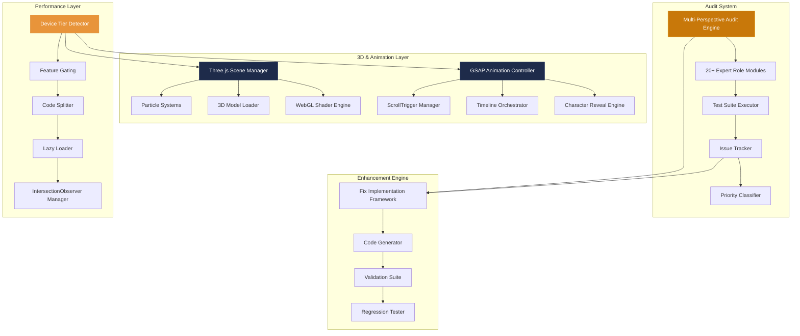
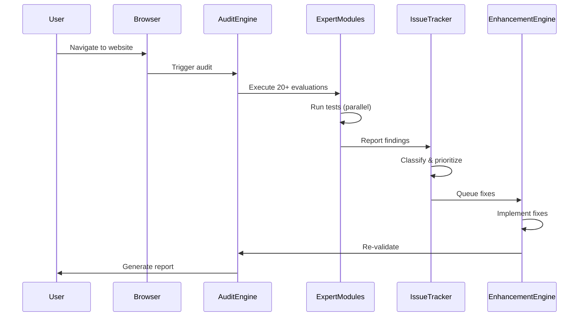

# High-Level Design Document: Comprehensive Mobile & Desktop Audit and Enhancement System

## 1. Overview

### 1.1 Purpose

This design document outlines the architecture for a comprehensive audit and enhancement system for the V3 Tour & Travels website (SONA CORRIDOR). The system will evaluate the website from 20+ elite expert perspectives across mobile and desktop viewports, identifying every issue from A to Z while implementing world-class immersive 3D experiences and premium animations that make the website 1000000000x more attractive, productive, and engaging.

### 1.2 Scope

The system encompasses:

- **Audit Framework**: Multi-perspective testing engine covering UX, accessibility, performance, security, SEO, and 20+ expert domains
- **Issue Tracking**: Comprehensive documentation and prioritization system for discovered problems
- **Enhancement Engine**: Implementation framework for fixes and improvements
- **3D Experience Layer**: Three.js-powered immersive visual effects with performance gating
- **Animation System**: GSAP-driven world-class animations with scroll-triggered reveals
- **Visual Effects**: Premium UI patterns including glassmorphism, particle systems, and kinetic typography
- **Performance Optimization**: Code splitting, lazy loading, and progressive enhancement strategies

### 1.3 Goals

1. **Zero Defects**: Identify and document every issue across 20+ expert perspectives
2. **WCAG AAA Compliance**: Achieve highest accessibility standards
3. **Sub-2.5s LCP**: Meet Core Web Vitals thresholds on mobile and desktop
4. **Immersive Experience**: Deliver world-class 3D and animation effects that enhance UX
5. **60fps Performance**: Maintain smooth animations across all device tiers
6. **Progressive Enhancement**: Ensure core functionality without JavaScript while delivering premium experiences for capable devices

### 1.4 Technology Stack

**Existing Foundation:**
- Next.js 16.2.6 (App Router, React 19)
- Tailwind CSS v4 (design tokens)
- GSAP 3.15.0 + @gsap/react 2.1.2
- Framer Motion 12.38.0
- Three.js 0.184.0
- Lenis 1.3.23 (smooth scroll)
- TypeScript 5

**New Additions:**
- @react-three/fiber (Three.js React renderer)
- @react-three/drei (Three.js helpers)
- react-intersection-observer (lazy loading)
- gsap/ScrollTrigger (scroll animations)
- gsap/SplitText (character-level reveals)


## 2. System Architecture

### 2.1 High-Level Architecture



### 2.2 Component Architecture

#### 2.2.1 Audit System Components

**Multi-Perspective Audit Engine**
- Orchestrates 20+ expert role evaluation modules
- Coordinates parallel test execution across viewports
- Aggregates findings from all perspectives
- Generates comprehensive audit reports

**Expert Role Modules** (20 specialized evaluators):
1. UX Designer Module
2. UI Designer Module
3. Accessibility Expert Module (WCAG 2.1 AA/AAA)
4. Performance Engineer Module
5. Mobile UX Specialist Module
6. Desktop UX Specialist Module
7. QA Tester Module
8. Security Analyst Module
9. SEO Expert Module
10. Content Strategist Module
11. Conversion Optimizer Module
12. Animation Director Module
13. Typography Expert Module
14. Color Theory Expert Module
15. Interaction Designer Module
16. Form UX Specialist Module
17. Loading State Designer Module
18. Error Handling Expert Module
19. Cross-Browser Tester Module
20. Device Tester Module

**Test Suite Executor**
- Runs automated tests (Playwright, Lighthouse, axe-core)
- Executes manual test checklists
- Validates against acceptance criteria
- Captures screenshots and recordings

**Issue Tracker**
- Documents discovered issues with full context
- Categorizes by severity (Critical, Major, Minor, Enhancement)
- Tracks resolution status (Open, In Progress, Resolved, Verified)
- Provides filtering and reporting capabilities

#### 2.2.2 Enhancement Engine Components

**Fix Implementation Framework**
- Provides implementation guidelines per issue type
- Generates code examples and best practices
- Validates fixes against acceptance criteria
- Ensures no regressions introduced

**Validation Suite**
- Re-runs affected tests after fixes
- Validates accessibility improvements
- Measures performance impact
- Verifies cross-browser compatibility

#### 2.2.3 3D & Animation Layer Components

**Three.js Scene Manager**
- Initializes WebGL contexts with fallback detection
- Manages scene lifecycle (create, update, dispose)
- Handles device tier-based feature gating
- Optimizes render loops for 60fps

**GSAP Animation Controller**
- Orchestrates all GSAP timelines
- Manages ScrollTrigger instances
- Coordinates character-level text reveals
- Respects prefers-reduced-motion

**Performance Gating System**
- Detects device tier (high/mid/low)
- Enables/disables features based on capability
- Monitors frame rate and throttles if needed
- Provides graceful degradation

### 2.3 Data Flow




## 3. 3D & Animation Architecture

### 3.1 Three.js Integration Strategy

#### 3.1.1 Scene Architecture

**Hero Particle System**
```typescript
interface ParticleSystemConfig {
  particleCount: number;        // 1000 (high), 500 (mid), 0 (low)
  particleSize: number;          // 0.05
  particleColor: string;         // '#C8780A' (gold)
  animationSpeed: number;        // 0.001
  mouseInfluence: boolean;       // true on high tier
  noiseScale: number;            // 0.5
}
```

**3D Card Tilt System**
```typescript
interface TiltConfig {
  maxTilt: number;               // 15 degrees
  perspective: number;           // 1000px
  scale: number;                 // 1.05 on hover
  transitionSpeed: number;       // 0.3s
  glareEffect: boolean;          // true on high tier
  shadowDepth: number;           // 20px
}
```

**Route Visualization 3D**
```typescript
interface RouteVisualizationConfig {
  pathGeometry: 'tube' | 'line'; // tube on high, line on mid
  pathColor: string;             // '#C8780A'
  pathWidth: number;             // 2
  animationDuration: number;     // 3s
  markerSize: number;            // 10
  cameraAngle: number;           // 45 degrees
}
```

#### 3.1.2 Performance Gating Logic

```typescript
type DeviceTier = 'high' | 'mid' | 'low';

interface FeatureGate {
  tier: DeviceTier;
  features: {
    particleSystems: boolean;
    cardTilt3D: boolean;
    webGLShaders: boolean;
    parallaxDepth: boolean;
    route3D: boolean;
    vehicleModels3D: boolean;
    floatingElements: boolean;
  };
}

const FEATURE_GATES: Record<DeviceTier, FeatureGate['features']> = {
  high: {
    particleSystems: true,
    cardTilt3D: true,
    webGLShaders: true,
    parallaxDepth: true,
    route3D: true,
    vehicleModels3D: true,
    floatingElements: true,
  },
  mid: {
    particleSystems: true,  // reduced count
    cardTilt3D: true,
    webGLShaders: false,
    parallaxDepth: true,
    route3D: true,          // simplified geometry
    vehicleModels3D: false,
    floatingElements: false,
  },
  low: {
    particleSystems: false,
    cardTilt3D: false,
    webGLShaders: false,
    parallaxDepth: false,
    route3D: false,
    vehicleModels3D: false,
    floatingElements: false,
  },
};
```

#### 3.1.3 Fallback Strategies

**Progressive Enhancement Approach:**
1. **Base Layer** (works without JavaScript): Static images, CSS transforms
2. **Enhanced Layer** (low tier): CSS 3D transforms, basic animations
3. **Premium Layer** (mid tier): Three.js with simplified geometry
4. **Ultimate Layer** (high tier): Full Three.js with shaders and particles

**Fallback Detection:**
```typescript
function detectWebGLSupport(): boolean {
  try {
    const canvas = document.createElement('canvas');
    return !!(
      window.WebGLRenderingContext &&
      (canvas.getContext('webgl') || canvas.getContext('experimental-webgl'))
    );
  } catch (e) {
    return false;
  }
}

function shouldEnableThreeJS(tier: DeviceTier): boolean {
  return tier !== 'low' && detectWebGLSupport();
}
```

### 3.2 GSAP Animation System

#### 3.2.1 Animation Architecture

**ScrollTrigger Configuration**
```typescript
interface ScrollTriggerConfig {
  trigger: string;               // CSS selector
  start: string;                 // 'top 80%'
  end: string;                   // 'bottom 20%'
  scrub: boolean | number;       // true or 1
  pin: boolean;                  // false by default
  markers: boolean;              // false in production
  toggleActions: string;         // 'play none none reverse'
}
```

**Animation Timeline Structure**
```typescript
interface AnimationTimeline {
  id: string;
  trigger: string;
  animations: Array<{
    target: string;
    properties: gsap.TweenVars;
    delay?: number;
    stagger?: number;
  }>;
  scrollTrigger?: ScrollTriggerConfig;
}
```

#### 3.2.2 Character-Level Text Reveals

**SplitText Implementation**
```typescript
interface TextRevealConfig {
  type: 'chars' | 'words' | 'lines';
  stagger: number;               // 0.03 for chars
  duration: number;              // 0.8
  ease: string;                  // 'power3.out'
  from: {
    opacity: number;             // 0
    y: number;                   // 100
    rotationX?: number;          // 90 (optional)
  };
  to: {
    opacity: number;             // 1
    y: number;                   // 0
    rotationX?: number;          // 0
  };
}
```

**Hero Headline Animation**
```typescript
const heroTextReveal: AnimationTimeline = {
  id: 'hero-text-reveal',
  trigger: '#hero',
  animations: [
    {
      target: '.hero-headline',
      properties: {
        opacity: 0,
        y: 100,
        stagger: {
          each: 0.03,
          from: 'start',
        },
        duration: 0.8,
        ease: 'power3.out',
      },
    },
  ],
};
```

#### 3.2.3 Magnetic Cursor Effect

**Magnetic Button Implementation**
```typescript
interface MagneticConfig {
  strength: number;              // 0.3 (30% pull)
  radius: number;                // 100px
  ease: string;                  // 'power3.out'
  duration: number;              // 0.3s
}

function applyMagneticEffect(button: HTMLElement, config: MagneticConfig) {
  const handleMouseMove = (e: MouseEvent) => {
    const rect = button.getBoundingClientRect();
    const centerX = rect.left + rect.width / 2;
    const centerY = rect.top + rect.height / 2;
    const distanceX = e.clientX - centerX;
    const distanceY = e.clientY - centerY;
    const distance = Math.sqrt(distanceX ** 2 + distanceY ** 2);
    
    if (distance < config.radius) {
      const pullX = distanceX * config.strength;
      const pullY = distanceY * config.strength;
      gsap.to(button, {
        x: pullX,
        y: pullY,
        duration: config.duration,
        ease: config.ease,
      });
    }
  };
  
  const handleMouseLeave = () => {
    gsap.to(button, {
      x: 0,
      y: 0,
      duration: config.duration,
      ease: config.ease,
    });
  };
  
  button.addEventListener('mousemove', handleMouseMove);
  button.addEventListener('mouseleave', handleMouseLeave);
}
```

#### 3.2.4 Scroll-Synced Video Scrubbing

**Video Scrub Implementation**
```typescript
interface VideoScrubConfig {
  videoElement: HTMLVideoElement;
  trigger: string;
  start: string;                 // 'top top'
  end: string;                   // 'bottom top'
  scrub: number;                 // 1
}

function createVideoScrub(config: VideoScrubConfig) {
  const video = config.videoElement;
  
  ScrollTrigger.create({
    trigger: config.trigger,
    start: config.start,
    end: config.end,
    scrub: config.scrub,
    onUpdate: (self) => {
      video.currentTime = video.duration * self.progress;
    },
  });
}
```

### 3.3 Performance Optimization Strategy

#### 3.3.1 Code Splitting

**Dynamic Imports for 3D Libraries**
```typescript
// Lazy load Three.js only when needed
const loadThreeJS = async () => {
  const [THREE, { Canvas }, { OrbitControls }] = await Promise.all([
    import('three'),
    import('@react-three/fiber'),
    import('@react-three/drei'),
  ]);
  return { THREE, Canvas, OrbitControls };
};

// Lazy load GSAP plugins
const loadGSAPPlugins = async () => {
  const [ScrollTrigger, SplitText] = await Promise.all([
    import('gsap/ScrollTrigger'),
    import('gsap/SplitText'),
  ]);
  return { ScrollTrigger, SplitText };
};
```

#### 3.3.2 IntersectionObserver for Animations

**Lazy Animation Initialization**
```typescript
function observeAndAnimate(element: HTMLElement, animation: () => void) {
  const observer = new IntersectionObserver(
    (entries) => {
      entries.forEach((entry) => {
        if (entry.isIntersecting) {
          animation();
          observer.unobserve(entry.target);
        }
      });
    },
    {
      threshold: 0.1,
      rootMargin: '50px',
    }
  );
  
  observer.observe(element);
}
```

#### 3.3.3 RequestAnimationFrame Optimization

**Throttled Scroll Handlers**
```typescript
function createThrottledScrollHandler(callback: () => void) {
  let ticking = false;
  
  return () => {
    if (!ticking) {
      window.requestAnimationFrame(() => {
        callback();
        ticking = false;
      });
      ticking = true;
    }
  };
}
```

#### 3.3.4 GPU Acceleration

**CSS Transform Optimization**
```css
.gpu-accelerated {
  transform: translateZ(0);
  will-change: transform;
  backface-visibility: hidden;
}
```

**GSAP Force3D**
```typescript
gsap.to(element, {
  x: 100,
  y: 50,
  force3D: true,  // Forces GPU acceleration
  duration: 1,
});
```


## 4. Component Enhancement Designs

### 4.1 Hero Section Enhancements

#### 4.1.1 3D Particle Background

**Visual Design:**
- 1000 floating gold particles (#C8780A) in 3D space
- Particles respond to mouse movement (parallax effect)
- Subtle noise-based animation for organic movement
- Particles fade in on page load with stagger

**Technical Implementation:**
```typescript
interface HeroParticleSystem {
  geometry: THREE.BufferGeometry;
  material: THREE.PointsMaterial;
  positions: Float32Array;
  velocities: Float32Array;
  mousePosition: { x: number; y: number };
}

const createHeroParticles = (count: number): HeroParticleSystem => {
  const geometry = new THREE.BufferGeometry();
  const positions = new Float32Array(count * 3);
  const velocities = new Float32Array(count * 3);
  
  for (let i = 0; i < count * 3; i += 3) {
    positions[i] = (Math.random() - 0.5) * 10;     // x
    positions[i + 1] = (Math.random() - 0.5) * 10; // y
    positions[i + 2] = (Math.random() - 0.5) * 5;  // z
    
    velocities[i] = (Math.random() - 0.5) * 0.01;
    velocities[i + 1] = (Math.random() - 0.5) * 0.01;
    velocities[i + 2] = (Math.random() - 0.5) * 0.01;
  }
  
  geometry.setAttribute('position', new THREE.BufferAttribute(positions, 3));
  
  const material = new THREE.PointsMaterial({
    color: 0xC8780A,
    size: 0.05,
    transparent: true,
    opacity: 0.6,
    blending: THREE.AdditiveBlending,
  });
  
  return { geometry, material, positions, velocities, mousePosition: { x: 0, y: 0 } };
};
```

**Animation Loop:**
```typescript
function animateParticles(system: HeroParticleSystem) {
  const positions = system.geometry.attributes.position.array as Float32Array;
  
  for (let i = 0; i < positions.length; i += 3) {
    // Apply velocity
    positions[i] += system.velocities[i];
    positions[i + 1] += system.velocities[i + 1];
    positions[i + 2] += system.velocities[i + 2];
    
    // Mouse influence
    const dx = system.mousePosition.x - positions[i];
    const dy = system.mousePosition.y - positions[i + 1];
    const distance = Math.sqrt(dx * dx + dy * dy);
    
    if (distance < 2) {
      positions[i] += dx * 0.01;
      positions[i + 1] += dy * 0.01;
    }
    
    // Boundary wrapping
    if (Math.abs(positions[i]) > 5) positions[i] *= -1;
    if (Math.abs(positions[i + 1]) > 5) positions[i + 1] *= -1;
    if (Math.abs(positions[i + 2]) > 2.5) positions[i + 2] *= -1;
  }
  
  system.geometry.attributes.position.needsUpdate = true;
}
```

#### 4.1.2 Kinetic Typography

**Character-Level Reveal:**
```typescript
const heroTextAnimation: AnimationTimeline = {
  id: 'hero-text-kinetic',
  trigger: '#hero',
  animations: [
    {
      target: '.hero-headline-line-1',
      properties: {
        opacity: 0,
        y: 120,
        rotationX: 90,
        stagger: {
          each: 0.03,
          from: 'start',
          ease: 'power3.out',
        },
        duration: 1.2,
        ease: 'power4.out',
      },
      delay: 0.3,
    },
    {
      target: '.hero-headline-line-2',
      properties: {
        opacity: 0,
        y: 120,
        rotationX: 90,
        stagger: {
          each: 0.03,
          from: 'start',
          ease: 'power3.out',
        },
        duration: 1.2,
        ease: 'power4.out',
      },
      delay: 0.5,
    },
  ],
};
```

**Morphing Text Effect (on scroll):**
```typescript
ScrollTrigger.create({
  trigger: '#hero',
  start: 'top top',
  end: 'bottom top',
  scrub: 1,
  onUpdate: (self) => {
    const progress = self.progress;
    gsap.to('.hero-headline', {
      scale: 1 - progress * 0.2,
      opacity: 1 - progress * 0.5,
      y: progress * -100,
    });
  },
});
```

#### 4.1.3 Booking Form Enhancements

**Multi-Step Progress Indicator:**
```typescript
interface FormStep {
  id: number;
  label: string;
  fields: string[];
  completed: boolean;
}

const formSteps: FormStep[] = [
  { id: 1, label: 'Trip Details', fields: ['pickup', 'drop', 'date', 'time'], completed: false },
  { id: 2, label: 'Your Info', fields: ['name', 'phone', 'passengers', 'vehicle'], completed: false },
];
```

**Step Transition Animation:**
```typescript
function animateStepTransition(from: number, to: number) {
  const timeline = gsap.timeline();
  
  timeline
    .to(`[data-step="${from}"]`, {
      opacity: 0,
      x: -50,
      duration: 0.3,
      ease: 'power2.in',
    })
    .set(`[data-step="${from}"]`, { display: 'none' })
    .set(`[data-step="${to}"]`, { display: 'block', opacity: 0, x: 50 })
    .to(`[data-step="${to}"]`, {
      opacity: 1,
      x: 0,
      duration: 0.3,
      ease: 'power2.out',
    });
}
```

**Input Focus Animations:**
```typescript
function enhanceFormInputs() {
  const inputs = document.querySelectorAll('input, select, textarea');
  
  inputs.forEach((input) => {
    input.addEventListener('focus', () => {
      gsap.to(input, {
        scale: 1.02,
        borderColor: '#C8780A',
        duration: 0.3,
        ease: 'power2.out',
      });
      
      // Animate label
      const label = input.previousElementSibling;
      if (label) {
        gsap.to(label, {
          y: -5,
          color: '#C8780A',
          duration: 0.3,
        });
      }
    });
    
    input.addEventListener('blur', () => {
      gsap.to(input, {
        scale: 1,
        borderColor: '#DEDBD2',
        duration: 0.3,
      });
      
      const label = input.previousElementSibling;
      if (label && !(input as HTMLInputElement).value) {
        gsap.to(label, {
          y: 0,
          color: '#6F6B63',
          duration: 0.3,
        });
      }
    });
  });
}
```

### 4.2 Fleet Showcase Enhancements

#### 4.2.1 3D Card Tilt Effect

**Tilt Implementation:**
```typescript
interface TiltState {
  rotateX: number;
  rotateY: number;
  scale: number;
  glareX: number;
  glareY: number;
  glareOpacity: number;
}

function create3DCardTilt(card: HTMLElement): TiltState {
  const state: TiltState = {
    rotateX: 0,
    rotateY: 0,
    scale: 1,
    glareX: 50,
    glareY: 50,
    glareOpacity: 0,
  };
  
  card.addEventListener('mousemove', (e) => {
    const rect = card.getBoundingClientRect();
    const x = e.clientX - rect.left;
    const y = e.clientY - rect.top;
    const centerX = rect.width / 2;
    const centerY = rect.height / 2;
    
    const rotateX = ((y - centerY) / centerY) * -15; // Max 15deg
    const rotateY = ((x - centerX) / centerX) * 15;
    
    gsap.to(card, {
      rotateX,
      rotateY,
      scale: 1.05,
      duration: 0.3,
      ease: 'power2.out',
      transformPerspective: 1000,
    });
    
    // Glare effect
    const glare = card.querySelector('.card-glare') as HTMLElement;
    if (glare) {
      gsap.to(glare, {
        backgroundPosition: `${(x / rect.width) * 100}% ${(y / rect.height) * 100}%`,
        opacity: 0.3,
        duration: 0.3,
      });
    }
    
    state.rotateX = rotateX;
    state.rotateY = rotateY;
    state.scale = 1.05;
  });
  
  card.addEventListener('mouseleave', () => {
    gsap.to(card, {
      rotateX: 0,
      rotateY: 0,
      scale: 1,
      duration: 0.5,
      ease: 'power2.out',
    });
    
    const glare = card.querySelector('.card-glare');
    if (glare) {
      gsap.to(glare, { opacity: 0, duration: 0.3 });
    }
  });
  
  return state;
}
```

**Glare Overlay:**
```css
.card-glare {
  position: absolute;
  inset: 0;
  background: radial-gradient(
    circle at center,
    rgba(255, 255, 255, 0.8) 0%,
    transparent 60%
  );
  opacity: 0;
  pointer-events: none;
  mix-blend-mode: overlay;
}
```

#### 4.2.2 Horizontal Scroll Section

**Pin and Scroll Implementation:**
```typescript
function createHorizontalScroll(container: HTMLElement) {
  const cards = gsap.utils.toArray('.fleet-card');
  const totalWidth = cards.reduce((sum, card: any) => sum + card.offsetWidth + 24, 0);
  
  gsap.to(cards, {
    x: () => -(totalWidth - window.innerWidth),
    ease: 'none',
    scrollTrigger: {
      trigger: container,
      pin: true,
      scrub: 1,
      end: () => `+=${totalWidth}`,
      anticipatePin: 1,
    },
  });
}
```

**Card Reveal on Scroll:**
```typescript
function animateFleetCards() {
  gsap.utils.toArray('.fleet-card').forEach((card: any, index) => {
    gsap.from(card, {
      opacity: 0,
      scale: 0.8,
      rotationY: -30,
      scrollTrigger: {
        trigger: card,
        start: 'left 80%',
        end: 'left 20%',
        scrub: 1,
        containerAnimation: horizontalScrollTween,
      },
    });
  });
}
```

#### 4.2.3 Hover Spec Reveal

**Expandable Details:**
```typescript
function createSpecReveal(card: HTMLElement) {
  const specs = card.querySelector('.fleet-specs') as HTMLElement;
  const features = card.querySelector('.fleet-features') as HTMLElement;
  
  card.addEventListener('mouseenter', () => {
    const timeline = gsap.timeline();
    
    timeline
      .to(specs, {
        height: 'auto',
        opacity: 1,
        duration: 0.4,
        ease: 'power2.out',
      })
      .to(features.querySelectorAll('li'), {
        opacity: 1,
        x: 0,
        stagger: 0.05,
        duration: 0.3,
      }, '-=0.2');
  });
  
  card.addEventListener('mouseleave', () => {
    gsap.to(specs, {
      height: 0,
      opacity: 0,
      duration: 0.3,
      ease: 'power2.in',
    });
  });
}
```

### 4.3 Route Corridor Enhancements

#### 4.3.1 Interactive 3D Route Map

**3D Path Visualization:**
```typescript
interface Route3DConfig {
  start: { x: number; y: number; z: number };
  end: { x: number; y: number; z: number };
  controlPoints: Array<{ x: number; y: number; z: number }>;
  color: string;
  width: number;
}

function create3DRoutePath(config: Route3DConfig): THREE.Mesh {
  const curve = new THREE.CatmullRomCurve3([
    new THREE.Vector3(config.start.x, config.start.y, config.start.z),
    ...config.controlPoints.map(p => new THREE.Vector3(p.x, p.y, p.z)),
    new THREE.Vector3(config.end.x, config.end.y, config.end.z),
  ]);
  
  const geometry = new THREE.TubeGeometry(curve, 64, config.width, 8, false);
  const material = new THREE.MeshBasicMaterial({
    color: config.color,
    transparent: true,
    opacity: 0.8,
  });
  
  return new THREE.Mesh(geometry, material);
}
```

**Animated Path Drawing:**
```typescript
function animateRoutePath(path: THREE.Mesh) {
  const material = path.material as THREE.MeshBasicMaterial;
  
  gsap.fromTo(
    material,
    { opacity: 0 },
    {
      opacity: 0.8,
      duration: 2,
      ease: 'power2.inOut',
      scrollTrigger: {
        trigger: '#route-corridor',
        start: 'top 60%',
        toggleActions: 'play none none reverse',
      },
    }
  );
  
  // Animate path drawing
  const drawProgress = { value: 0 };
  gsap.to(drawProgress, {
    value: 1,
    duration: 3,
    ease: 'power2.inOut',
    onUpdate: () => {
      path.geometry.setDrawRange(0, Math.floor(path.geometry.attributes.position.count * drawProgress.value));
    },
    scrollTrigger: {
      trigger: '#route-corridor',
      start: 'top 60%',
      toggleActions: 'play none none reverse',
    },
  });
}
```

#### 4.3.2 Route Card Interactions

**Hover Elevation Effect:**
```typescript
function enhanceRouteCards() {
  const cards = document.querySelectorAll('.route-card');
  
  cards.forEach((card) => {
    card.addEventListener('mouseenter', () => {
      gsap.to(card, {
        y: -10,
        scale: 1.02,
        boxShadow: '0 20px 60px rgba(200, 120, 10, 0.2)',
        duration: 0.3,
        ease: 'power2.out',
      });
      
      // Animate route code
      const code = card.querySelector('.route-code');
      gsap.to(code, {
        color: '#C8780A',
        scale: 1.1,
        duration: 0.3,
      });
    });
    
    card.addEventListener('mouseleave', () => {
      gsap.to(card, {
        y: 0,
        scale: 1,
        boxShadow: '0 16px 50px rgba(23, 17, 10, 0.08)',
        duration: 0.3,
      });
      
      const code = card.querySelector('.route-code');
      gsap.to(code, {
        color: '#6F6B63',
        scale: 1,
        duration: 0.3,
      });
    });
  });
}
```

**Distance Counter Animation:**
```typescript
function animateDistanceCounter(element: HTMLElement, targetValue: number) {
  const counter = { value: 0 };
  
  gsap.to(counter, {
    value: targetValue,
    duration: 2,
    ease: 'power2.out',
    onUpdate: () => {
      element.textContent = `${Math.round(counter.value)} km`;
    },
    scrollTrigger: {
      trigger: element,
      start: 'top 80%',
      toggleActions: 'play none none reverse',
    },
  });
}
```

### 4.4 Gallery Enhancements

#### 4.4.1 Drag-to-Explore Gallery

**Draggable Implementation:**
```typescript
import { useDrag } from '@use-gesture/react';

function DraggableGallery({ images }: { images: string[] }) {
  const [position, setPosition] = useState({ x: 0, y: 0 });
  const [isDragging, setIsDragging] = useState(false);
  
  const bind = useDrag(({ offset: [x, y], dragging }) => {
    setPosition({ x, y });
    setIsDragging(dragging);
  }, {
    bounds: { left: -2000, right: 0, top: 0, bottom: 0 },
    rubberband: true,
  });
  
  return (
    <div
      {...bind()}
      style={{
        transform: `translate3d(${position.x}px, ${position.y}px, 0)`,
        cursor: isDragging ? 'grabbing' : 'grab',
      }}
      className="flex gap-6"
    >
      {images.map((img, i) => (
        <GalleryImage key={i} src={img} index={i} />
      ))}
    </div>
  );
}
```

#### 4.4.2 Lightbox with Transitions

**Lightbox Animation:**
```typescript
function openLightbox(imageIndex: number) {
  const lightbox = document.querySelector('.lightbox') as HTMLElement;
  const image = lightbox.querySelector('img') as HTMLImageElement;
  
  // Set image
  image.src = images[imageIndex];
  
  // Animate open
  const timeline = gsap.timeline();
  
  timeline
    .set(lightbox, { display: 'flex' })
    .fromTo(
      lightbox,
      { opacity: 0 },
      { opacity: 1, duration: 0.3 }
    )
    .fromTo(
      image,
      { scale: 0.8, opacity: 0 },
      { scale: 1, opacity: 1, duration: 0.4, ease: 'back.out(1.2)' },
      '-=0.2'
    );
}

function closeLightbox() {
  const lightbox = document.querySelector('.lightbox') as HTMLElement;
  const image = lightbox.querySelector('img') as HTMLImageElement;
  
  const timeline = gsap.timeline();
  
  timeline
    .to(image, {
      scale: 0.8,
      opacity: 0,
      duration: 0.3,
      ease: 'power2.in',
    })
    .to(lightbox, {
      opacity: 0,
      duration: 0.2,
      onComplete: () => {
        lightbox.style.display = 'none';
      },
    }, '-=0.1');
}
```

#### 4.4.3 Image Zoom on Hover

**Zoom Effect:**
```typescript
function createImageZoom(container: HTMLElement) {
  const image = container.querySelector('img') as HTMLImageElement;
  
  container.addEventListener('mouseenter', () => {
    gsap.to(image, {
      scale: 1.1,
      duration: 0.6,
      ease: 'power2.out',
    });
  });
  
  container.addEventListener('mouseleave', () => {
    gsap.to(image, {
      scale: 1,
      duration: 0.6,
      ease: 'power2.out',
    });
  });
  
  // Parallax on mouse move
  container.addEventListener('mousemove', (e) => {
    const rect = container.getBoundingClientRect();
    const x = ((e.clientX - rect.left) / rect.width - 0.5) * 20;
    const y = ((e.clientY - rect.top) / rect.height - 0.5) * 20;
    
    gsap.to(image, {
      x,
      y,
      duration: 0.3,
      ease: 'power2.out',
    });
  });
}
```

### 4.5 Testimonials Enhancements

#### 4.5.1 Swipeable Carousel

**Swipe Implementation:**
```typescript
function createSwipeableCarousel(container: HTMLElement) {
  const slides = Array.from(container.querySelectorAll('.testimonial-slide'));
  let currentIndex = 0;
  
  const bind = useDrag(({ swipe: [swipeX] }) => {
    if (swipeX === -1 && currentIndex < slides.length - 1) {
      // Swipe left (next)
      currentIndex++;
      animateToSlide(currentIndex);
    } else if (swipeX === 1 && currentIndex > 0) {
      // Swipe right (prev)
      currentIndex--;
      animateToSlide(currentIndex);
    }
  }, {
    swipe: { distance: 50 },
  });
  
  function animateToSlide(index: number) {
    gsap.to(container, {
      x: -index * 100 + '%',
      duration: 0.6,
      ease: 'power2.inOut',
    });
    
    // Update indicators
    updateIndicators(index);
  }
  
  return bind;
}
```

#### 4.5.2 Parallax Testimonial Cards

**Parallax Effect:**
```typescript
function createTestimonialParallax() {
  const cards = gsap.utils.toArray('.testimonial-card');
  
  cards.forEach((card: any, index) => {
    const depth = (index % 3) * 50; // Stagger depth
    
    gsap.to(card, {
      y: depth,
      scrollTrigger: {
        trigger: '#testimonials',
        start: 'top bottom',
        end: 'bottom top',
        scrub: 1,
      },
    });
  });
}
```

### 4.6 Booking Flow Enhancements

#### 4.6.1 Multi-Step Progress Indicator

**Progress Bar Animation:**
```typescript
function animateProgressBar(currentStep: number, totalSteps: number) {
  const progress = (currentStep / totalSteps) * 100;
  
  gsap.to('.progress-bar-fill', {
    width: `${progress}%`,
    duration: 0.6,
    ease: 'power2.out',
  });
  
  // Animate step indicators
  for (let i = 1; i <= totalSteps; i++) {
    const indicator = document.querySelector(`[data-step-indicator="${i}"]`);
    
    if (i < currentStep) {
      // Completed
      gsap.to(indicator, {
        backgroundColor: '#C8780A',
        scale: 1,
        duration: 0.3,
      });
    } else if (i === currentStep) {
      // Active
      gsap.to(indicator, {
        backgroundColor: '#C8780A',
        scale: 1.2,
        duration: 0.3,
      });
    } else {
      // Upcoming
      gsap.to(indicator, {
        backgroundColor: '#DEDBD2',
        scale: 1,
        duration: 0.3,
      });
    }
  }
}
```


## 5. Visual Design System Enhancements

### 5.1 Extended Color Palette

#### 5.1.1 Gradient Definitions

```css
:root {
  /* Gold Gradients */
  --gradient-gold-radial: radial-gradient(
    circle at center,
    #F0B429 0%,
    #C8780A 100%
  );
  
  --gradient-gold-linear: linear-gradient(
    135deg,
    #F0B429 0%,
    #C8780A 50%,
    #E8943A 100%
  );
  
  --gradient-gold-mesh: conic-gradient(
    from 180deg at 50% 50%,
    #F0B429 0deg,
    #C8780A 120deg,
    #E8943A 240deg,
    #F0B429 360deg
  );
  
  /* Cream Gradients */
  --gradient-cream-soft: linear-gradient(
    180deg,
    #F8F3EA 0%,
    #F6F1E7 100%
  );
  
  --gradient-cream-warm: linear-gradient(
    135deg,
    #F1E6D2 0%,
    #F6F1E7 50%,
    #F8F3EA 100%
  );
  
  /* Indigo Gradients */
  --gradient-indigo-deep: linear-gradient(
    180deg,
    #1E2B4A 0%,
    #2D3E6A 100%
  );
  
  /* Overlay Gradients */
  --gradient-overlay-dark: linear-gradient(
    180deg,
    rgba(26, 18, 8, 0) 0%,
    rgba(26, 18, 8, 0.8) 100%
  );
  
  --gradient-overlay-gold: linear-gradient(
    135deg,
    rgba(240, 180, 41, 0.1) 0%,
    rgba(200, 120, 10, 0.2) 100%
  );
}
```

#### 5.1.2 Animated Gradients

```typescript
function createAnimatedGradient(element: HTMLElement) {
  const gradientAnimation = gsap.to(element, {
    backgroundPosition: '200% center',
    duration: 3,
    ease: 'none',
    repeat: -1,
  });
  
  return gradientAnimation;
}

// CSS for animated gradient
const animatedGradientCSS = `
.animated-gradient {
  background: linear-gradient(
    270deg,
    #F0B429,
    #C8780A,
    #E8943A,
    #F0B429
  );
  background-size: 200% 200%;
  animation: gradient-shift 3s ease infinite;
}

@keyframes gradient-shift {
  0% { background-position: 0% 50%; }
  50% { background-position: 100% 50%; }
  100% { background-position: 0% 50%; }
}
`;
```

### 5.2 Animation Timing Tokens

```css
:root {
  /* Duration Tokens */
  --duration-instant: 0.1s;
  --duration-fast: 0.2s;
  --duration-normal: 0.3s;
  --duration-slow: 0.5s;
  --duration-slower: 0.8s;
  --duration-slowest: 1.2s;
  
  /* Easing Tokens */
  --ease-in-quad: cubic-bezier(0.55, 0.085, 0.68, 0.53);
  --ease-out-quad: cubic-bezier(0.25, 0.46, 0.45, 0.94);
  --ease-in-out-quad: cubic-bezier(0.455, 0.03, 0.515, 0.955);
  
  --ease-in-cubic: cubic-bezier(0.55, 0.055, 0.675, 0.19);
  --ease-out-cubic: cubic-bezier(0.215, 0.61, 0.355, 1);
  --ease-in-out-cubic: cubic-bezier(0.645, 0.045, 0.355, 1);
  
  --ease-in-quart: cubic-bezier(0.895, 0.03, 0.685, 0.22);
  --ease-out-quart: cubic-bezier(0.165, 0.84, 0.44, 1);
  --ease-in-out-quart: cubic-bezier(0.77, 0, 0.175, 1);
  
  --ease-elastic: cubic-bezier(0.68, -0.55, 0.265, 1.55);
  --ease-bounce: cubic-bezier(0.34, 1.56, 0.64, 1);
  
  /* GSAP Easing Equivalents */
  --ease-power1-out: cubic-bezier(0.25, 0.46, 0.45, 0.94);
  --ease-power2-out: cubic-bezier(0.215, 0.61, 0.355, 1);
  --ease-power3-out: cubic-bezier(0.165, 0.84, 0.44, 1);
  --ease-power4-out: cubic-bezier(0.23, 1, 0.32, 1);
  
  --ease-back-out: cubic-bezier(0.34, 1.56, 0.64, 1);
  --ease-circ-out: cubic-bezier(0.075, 0.82, 0.165, 1);
  --ease-expo-out: cubic-bezier(0.19, 1, 0.22, 1);
}
```

### 5.3 3D Depth Layers

```css
:root {
  /* Z-Index Layers */
  --z-base: 0;
  --z-content: 10;
  --z-elevated: 20;
  --z-floating: 30;
  --z-overlay: 40;
  --z-modal: 50;
  --z-toast: 60;
  --z-cursor: 9997;
  --z-grain: 9998;
  --z-debug: 9999;
  
  /* 3D Transform Depths */
  --depth-near: translateZ(50px);
  --depth-mid: translateZ(30px);
  --depth-far: translateZ(10px);
  --depth-background: translateZ(-50px);
  
  /* Perspective Values */
  --perspective-close: 500px;
  --perspective-normal: 1000px;
  --perspective-far: 2000px;
}
```

**3D Layer Classes:**
```css
.layer-near {
  transform: var(--depth-near);
  z-index: var(--z-floating);
}

.layer-mid {
  transform: var(--depth-mid);
  z-index: var(--z-elevated);
}

.layer-far {
  transform: var(--depth-far);
  z-index: var(--z-content);
}

.layer-background {
  transform: var(--depth-background);
  z-index: var(--z-base);
}

.perspective-container {
  perspective: var(--perspective-normal);
  transform-style: preserve-3d;
}
```

### 5.4 Shadow System

```css
:root {
  /* Elevation Shadows */
  --shadow-xs: 0 1px 2px rgba(26, 18, 8, 0.05);
  --shadow-sm: 0 2px 4px rgba(26, 18, 8, 0.06);
  --shadow-md: 0 4px 8px rgba(26, 18, 8, 0.08);
  --shadow-lg: 0 8px 16px rgba(26, 18, 8, 0.1);
  --shadow-xl: 0 16px 32px rgba(26, 18, 8, 0.12);
  --shadow-2xl: 0 24px 48px rgba(26, 18, 8, 0.15);
  --shadow-3xl: 0 40px 80px rgba(26, 18, 8, 0.2);
  
  /* Colored Shadows */
  --shadow-gold: 0 8px 32px rgba(200, 120, 10, 0.3);
  --shadow-gold-lg: 0 16px 48px rgba(200, 120, 10, 0.4);
  --shadow-indigo: 0 8px 32px rgba(30, 43, 74, 0.3);
  
  /* Inner Shadows */
  --shadow-inner: inset 0 2px 4px rgba(26, 18, 8, 0.06);
  --shadow-inner-lg: inset 0 4px 8px rgba(26, 18, 8, 0.1);
  
  /* Neumorphism Shadows */
  --shadow-neumorphic: 
    8px 8px 16px rgba(26, 18, 8, 0.1),
    -8px -8px 16px rgba(255, 255, 255, 0.7);
}
```

### 5.5 Glow Effects

```css
:root {
  /* Glow Intensities */
  --glow-subtle: 0 0 20px rgba(240, 180, 41, 0.2);
  --glow-medium: 0 0 40px rgba(240, 180, 41, 0.3);
  --glow-strong: 0 0 60px rgba(240, 180, 41, 0.4);
  --glow-intense: 0 0 80px rgba(240, 180, 41, 0.5);
  
  /* Animated Glow */
  --glow-pulse: 0 0 40px rgba(240, 180, 41, 0.4);
}

.glow-gold {
  box-shadow: var(--glow-medium);
  transition: box-shadow var(--duration-normal) var(--ease-out-cubic);
}

.glow-gold:hover {
  box-shadow: var(--glow-strong);
}

@keyframes glow-pulse {
  0%, 100% {
    box-shadow: 0 0 20px rgba(240, 180, 41, 0.2);
  }
  50% {
    box-shadow: 0 0 60px rgba(240, 180, 41, 0.5);
  }
}

.glow-pulse {
  animation: glow-pulse 2s ease-in-out infinite;
}
```

### 5.6 Blur Effects

```css
:root {
  /* Blur Amounts */
  --blur-xs: blur(2px);
  --blur-sm: blur(4px);
  --blur-md: blur(8px);
  --blur-lg: blur(16px);
  --blur-xl: blur(24px);
  --blur-2xl: blur(40px);
  
  /* Backdrop Blur (Glassmorphism) */
  --backdrop-blur-sm: blur(4px);
  --backdrop-blur-md: blur(12px);
  --backdrop-blur-lg: blur(20px);
}

.glassmorphism {
  background: rgba(246, 241, 231, 0.7);
  backdrop-filter: var(--backdrop-blur-md);
  border: 1px solid rgba(255, 255, 255, 0.2);
  box-shadow: 0 8px 32px rgba(26, 18, 8, 0.1);
}

.glassmorphism-dark {
  background: rgba(26, 18, 8, 0.7);
  backdrop-filter: var(--backdrop-blur-md);
  border: 1px solid rgba(255, 255, 255, 0.1);
  box-shadow: 0 8px 32px rgba(0, 0, 0, 0.3);
}
```

### 5.7 Neumorphism Effects

```css
.neumorphic-light {
  background: #F6F1E7;
  box-shadow: 
    8px 8px 16px rgba(26, 18, 8, 0.1),
    -8px -8px 16px rgba(255, 255, 255, 0.7);
  border-radius: var(--radius-lg);
}

.neumorphic-light:active {
  box-shadow: 
    inset 4px 4px 8px rgba(26, 18, 8, 0.1),
    inset -4px -4px 8px rgba(255, 255, 255, 0.7);
}

.neumorphic-dark {
  background: #1A1208;
  box-shadow: 
    8px 8px 16px rgba(0, 0, 0, 0.4),
    -8px -8px 16px rgba(255, 255, 255, 0.05);
  border-radius: var(--radius-lg);
}
```

### 5.8 Grain Texture Overlay

```css
.grain-overlay {
  position: fixed;
  inset: 0;
  pointer-events: none;
  z-index: var(--z-grain);
  opacity: 0.035;
  background-image: url("data:image/svg+xml,%3Csvg viewBox='0 0 256 256' xmlns='http://www.w3.org/2000/svg'%3E%3Cfilter id='noise'%3E%3CfeTurbulence type='fractalNoise' baseFrequency='0.85' numOctaves='4' stitchTiles='stitch'/%3E%3C/filter%3E%3Crect width='100%25' height='100%25' filter='url(%23noise)'/%3E%3C/svg%3E");
  background-repeat: repeat;
  mix-blend-mode: overlay;
  animation: grain-animation 8s steps(10) infinite;
}

@keyframes grain-animation {
  0%, 100% { transform: translate(0, 0); }
  10% { transform: translate(-5%, -10%); }
  20% { transform: translate(-15%, 5%); }
  30% { transform: translate(7%, -25%); }
  40% { transform: translate(-5%, 25%); }
  50% { transform: translate(-15%, 10%); }
  60% { transform: translate(15%, 0%); }
  70% { transform: translate(0%, 15%); }
  80% { transform: translate(3%, 35%); }
  90% { transform: translate(-10%, 10%); }
}
```


## 6. Technical Implementation Strategy

### 6.1 Progressive Enhancement Approach

#### 6.1.1 Enhancement Layers

**Layer 1: Base (No JavaScript)**
- Semantic HTML structure
- CSS-only layouts and basic styling
- Server-rendered content
- Functional forms with native validation
- Static images with proper alt text

**Layer 2: Enhanced (Low-Tier Devices)**
- CSS 3D transforms for basic depth
- CSS transitions for hover states
- Intersection Observer for lazy loading
- Basic scroll animations with CSS
- Touch-friendly interactions

**Layer 3: Premium (Mid-Tier Devices)**
- GSAP animations (no ScrollTrigger)
- Framer Motion for component animations
- Three.js with simplified geometry
- Reduced particle counts
- Basic parallax effects

**Layer 4: Ultimate (High-Tier Devices)**
- Full GSAP with ScrollTrigger and SplitText
- Three.js with shaders and particles
- WebGL effects
- Complex parallax and 3D transforms
- Magnetic cursor and advanced interactions

#### 6.1.2 Feature Detection

```typescript
interface FeatureSupport {
  webgl: boolean;
  intersectionObserver: boolean;
  resizeObserver: boolean;
  webWorkers: boolean;
  serviceWorker: boolean;
  webp: boolean;
  avif: boolean;
  cssGrid: boolean;
  cssCustomProperties: boolean;
  touchEvents: boolean;
  pointerEvents: boolean;
  reducedMotion: boolean;
}

function detectFeatureSupport(): FeatureSupport {
  return {
    webgl: (() => {
      try {
        const canvas = document.createElement('canvas');
        return !!(
          window.WebGLRenderingContext &&
          (canvas.getContext('webgl') || canvas.getContext('experimental-webgl'))
        );
      } catch (e) {
        return false;
      }
    })(),
    intersectionObserver: 'IntersectionObserver' in window,
    resizeObserver: 'ResizeObserver' in window,
    webWorkers: 'Worker' in window,
    serviceWorker: 'serviceWorker' in navigator,
    webp: (() => {
      const canvas = document.createElement('canvas');
      return canvas.toDataURL('image/webp').indexOf('data:image/webp') === 0;
    })(),
    avif: false, // Requires async check
    cssGrid: CSS.supports('display', 'grid'),
    cssCustomProperties: CSS.supports('--test', '0'),
    touchEvents: 'ontouchstart' in window,
    pointerEvents: 'PointerEvent' in window,
    reducedMotion: window.matchMedia('(prefers-reduced-motion: reduce)').matches,
  };
}
```

#### 6.1.3 Device Tier Detection

```typescript
interface DeviceCapabilities {
  cores: number;
  memory: number; // GB
  connection: 'slow-2g' | '2g' | '3g' | '4g' | 'unknown';
  gpu: 'high' | 'mid' | 'low';
}

function detectDeviceCapabilities(): DeviceCapabilities {
  const nav = navigator as any;
  
  return {
    cores: nav.hardwareConcurrency || 4,
    memory: nav.deviceMemory || 4,
    connection: (nav.connection?.effectiveType || 'unknown') as any,
    gpu: detectGPUTier(),
  };
}

function detectGPUTier(): 'high' | 'mid' | 'low' {
  const canvas = document.createElement('canvas');
  const gl = canvas.getContext('webgl') || canvas.getContext('experimental-webgl');
  
  if (!gl) return 'low';
  
  const debugInfo = (gl as any).getExtension('WEBGL_debug_renderer_info');
  if (!debugInfo) return 'mid';
  
  const renderer = (gl as any).getParameter(debugInfo.UNMASKED_RENDERER_WEBGL);
  
  // High-end GPUs
  if (/nvidia|geforce|radeon|amd/i.test(renderer)) return 'high';
  
  // Integrated GPUs
  if (/intel|uhd|iris/i.test(renderer)) return 'mid';
  
  return 'low';
}

function calculateDeviceTier(capabilities: DeviceCapabilities): DeviceTier {
  let score = 0;
  
  // CPU cores
  if (capabilities.cores >= 8) score += 3;
  else if (capabilities.cores >= 4) score += 2;
  else score += 1;
  
  // Memory
  if (capabilities.memory >= 8) score += 3;
  else if (capabilities.memory >= 4) score += 2;
  else score += 1;
  
  // Connection
  if (capabilities.connection === '4g') score += 2;
  else if (capabilities.connection === '3g') score += 1;
  
  // GPU
  if (capabilities.gpu === 'high') score += 3;
  else if (capabilities.gpu === 'mid') score += 2;
  else score += 1;
  
  // Tier classification
  if (score >= 9) return 'high';
  if (score >= 5) return 'mid';
  return 'low';
}
```

### 6.2 Performance Budgets

#### 6.2.1 Budget Targets

```typescript
interface PerformanceBudget {
  // Core Web Vitals
  LCP: number;           // Largest Contentful Paint (ms)
  FID: number;           // First Input Delay (ms)
  CLS: number;           // Cumulative Layout Shift
  
  // Additional Metrics
  FCP: number;           // First Contentful Paint (ms)
  TTI: number;           // Time to Interactive (ms)
  TBT: number;           // Total Blocking Time (ms)
  SI: number;            // Speed Index
  
  // Resource Budgets
  totalJS: number;       // Total JavaScript (KB)
  totalCSS: number;      // Total CSS (KB)
  totalImages: number;   // Total Images (KB)
  totalFonts: number;    // Total Fonts (KB)
  
  // Request Counts
  maxRequests: number;
  maxThirdParty: number;
}

const PERFORMANCE_BUDGETS: Record<'mobile' | 'desktop', PerformanceBudget> = {
  mobile: {
    LCP: 2500,
    FID: 100,
    CLS: 0.1,
    FCP: 1800,
    TTI: 3800,
    TBT: 300,
    SI: 3400,
    totalJS: 300,
    totalCSS: 50,
    totalImages: 500,
    totalFonts: 100,
    maxRequests: 50,
    maxThirdParty: 10,
  },
  desktop: {
    LCP: 2000,
    FID: 50,
    CLS: 0.1,
    FCP: 1200,
    TTI: 2500,
    TBT: 200,
    SI: 2000,
    totalJS: 500,
    totalCSS: 75,
    totalImages: 800,
    totalFonts: 150,
    maxRequests: 75,
    maxThirdParty: 15,
  },
};
```

#### 6.2.2 Performance Monitoring

```typescript
interface PerformanceMetrics {
  LCP: number;
  FID: number;
  CLS: number;
  FCP: number;
  TTFB: number;
  deviceTier: DeviceTier;
  timestamp: number;
}

function measurePerformance(): PerformanceMetrics {
  const navigation = performance.getEntriesByType('navigation')[0] as PerformanceNavigationTiming;
  const paint = performance.getEntriesByType('paint');
  
  return {
    LCP: 0, // Measured via PerformanceObserver
    FID: 0, // Measured via PerformanceObserver
    CLS: 0, // Measured via PerformanceObserver
    FCP: paint.find(p => p.name === 'first-contentful-paint')?.startTime || 0,
    TTFB: navigation.responseStart - navigation.requestStart,
    deviceTier: getDeviceTier(),
    timestamp: Date.now(),
  };
}

function setupPerformanceObservers() {
  // LCP Observer
  new PerformanceObserver((list) => {
    const entries = list.getEntries();
    const lastEntry = entries[entries.length - 1] as any;
    console.log('LCP:', lastEntry.renderTime || lastEntry.loadTime);
  }).observe({ entryTypes: ['largest-contentful-paint'] });
  
  // FID Observer
  new PerformanceObserver((list) => {
    const entries = list.getEntries();
    entries.forEach((entry: any) => {
      console.log('FID:', entry.processingStart - entry.startTime);
    });
  }).observe({ entryTypes: ['first-input'] });
  
  // CLS Observer
  let clsScore = 0;
  new PerformanceObserver((list) => {
    list.getEntries().forEach((entry: any) => {
      if (!entry.hadRecentInput) {
        clsScore += entry.value;
        console.log('CLS:', clsScore);
      }
    });
  }).observe({ entryTypes: ['layout-shift'] });
}
```

### 6.3 Browser Compatibility

#### 6.3.1 Target Browsers

```typescript
const BROWSER_SUPPORT = {
  chrome: '>=90',
  firefox: '>=88',
  safari: '>=14',
  edge: '>=90',
  ios: '>=14',
  android: '>=90',
};
```

#### 6.3.2 Polyfills and Fallbacks

```typescript
// Intersection Observer Polyfill
async function ensureIntersectionObserver() {
  if (!('IntersectionObserver' in window)) {
    await import('intersection-observer');
  }
}

// ResizeObserver Polyfill
async function ensureResizeObserver() {
  if (!('ResizeObserver' in window)) {
    await import('@juggle/resize-observer');
  }
}

// Smooth Scroll Polyfill
function ensureSmoothScroll() {
  if (!('scrollBehavior' in document.documentElement.style)) {
    import('smoothscroll-polyfill').then(smoothscroll => {
      smoothscroll.polyfill();
    });
  }
}
```

### 6.4 Mobile Optimization

#### 6.4.1 Touch Optimization

```typescript
interface TouchConfig {
  minTouchTarget: number;  // 44px minimum
  tapDelay: number;        // 0ms (no delay)
  swipeThreshold: number;  // 50px
  longPressDelay: number;  // 500ms
}

const TOUCH_CONFIG: TouchConfig = {
  minTouchTarget: 44,
  tapDelay: 0,
  swipeThreshold: 50,
  longPressDelay: 500,
};

// Remove 300ms tap delay
function removeTapDelay() {
  document.addEventListener('touchstart', () => {}, { passive: true });
}

// Ensure touch targets are large enough
function validateTouchTargets() {
  const interactiveElements = document.querySelectorAll('a, button, input, select, textarea');
  
  interactiveElements.forEach((el) => {
    const rect = el.getBoundingClientRect();
    if (rect.width < TOUCH_CONFIG.minTouchTarget || rect.height < TOUCH_CONFIG.minTouchTarget) {
      console.warn('Touch target too small:', el, rect);
    }
  });
}
```

#### 6.4.2 Viewport Optimization

```typescript
// Safe area insets for notched devices
const safeAreaCSS = `
.safe-area-top {
  padding-top: env(safe-area-inset-top);
}

.safe-area-bottom {
  padding-bottom: env(safe-area-inset-bottom);
}

.safe-area-left {
  padding-left: env(safe-area-inset-left);
}

.safe-area-right {
  padding-right: env(safe-area-inset-right);
}
`;

// Viewport height fix for mobile browsers
const viewportHeightFix = `
:root {
  --vh: 1vh;
}

@supports (-webkit-touch-callout: none) {
  :root {
    --vh: calc(var(--vh, 1vh) * 100);
  }
}

.full-height {
  height: 100vh;
  height: var(--vh);
}
`;

function setViewportHeight() {
  const vh = window.innerHeight * 0.01;
  document.documentElement.style.setProperty('--vh', `${vh}px`);
}

window.addEventListener('resize', setViewportHeight);
setViewportHeight();
```


## 7. Data Models & State Management

### 7.1 Audit Results Structure

```typescript
interface AuditResult {
  id: string;
  timestamp: number;
  version: string;
  summary: AuditSummary;
  expertFindings: ExpertFindings[];
  issues: Issue[];
  metrics: PerformanceMetrics;
  recommendations: Recommendation[];
}

interface AuditSummary {
  totalIssues: number;
  criticalCount: number;
  majorCount: number;
  minorCount: number;
  enhancementCount: number;
  overallScore: number; // 0-100
  wcagLevel: 'A' | 'AA' | 'AAA' | 'Fail';
  performanceGrade: 'A' | 'B' | 'C' | 'D' | 'F';
}

interface ExpertFindings {
  expertRole: ExpertRole;
  issuesFound: number;
  criticalIssues: string[];
  majorIssues: string[];
  minorIssues: string[];
  enhancements: string[];
  notes: string;
}

type ExpertRole =
  | 'UX Designer'
  | 'UI Designer'
  | 'Accessibility Expert'
  | 'Performance Engineer'
  | 'Mobile UX Specialist'
  | 'Desktop UX Specialist'
  | 'QA Tester'
  | 'Security Analyst'
  | 'SEO Expert'
  | 'Content Strategist'
  | 'Conversion Optimizer'
  | 'Animation Director'
  | 'Typography Expert'
  | 'Color Theory Expert'
  | 'Interaction Designer'
  | 'Form UX Specialist'
  | 'Loading State Designer'
  | 'Error Handling Expert'
  | 'Cross-Browser Tester'
  | 'Device Tester';
```

### 7.2 Issue Tracking Schema

```typescript
interface Issue {
  id: string;
  title: string;
  description: string;
  severity: 'critical' | 'major' | 'minor' | 'enhancement';
  category: IssueCategory;
  affectedComponents: string[];
  affectedViewports: ('mobile' | 'desktop')[];
  affectedBrowsers: string[];
  discoveredBy: ExpertRole[];
  stepsToReproduce: string[];
  expectedBehavior: string;
  actualBehavior: string;
  suggestedFix: string;
  codeExample?: string;
  screenshots?: string[];
  status: IssueStatus;
  priority: number; // 1-10
  assignee?: string;
  createdAt: number;
  updatedAt: number;
  resolvedAt?: number;
}

type IssueCategory =
  | 'Accessibility'
  | 'Performance'
  | 'Security'
  | 'SEO'
  | 'UX'
  | 'UI'
  | 'Animation'
  | 'Typography'
  | 'Color'
  | 'Forms'
  | 'Navigation'
  | 'Content'
  | 'Responsive'
  | 'Cross-Browser'
  | 'Error Handling'
  | 'Loading States';

type IssueStatus =
  | 'open'
  | 'in_progress'
  | 'resolved'
  | 'verified'
  | 'wont_fix'
  | 'duplicate';

interface Recommendation {
  id: string;
  title: string;
  description: string;
  impact: 'high' | 'medium' | 'low';
  effort: 'high' | 'medium' | 'low';
  category: IssueCategory;
  relatedIssues: string[];
  implementation: string;
  resources: string[];
}
```

### 7.3 Animation State Management

```typescript
interface AnimationState {
  activeTimelines: Map<string, gsap.core.Timeline>;
  scrollTriggers: Map<string, ScrollTrigger>;
  particleSystems: Map<string, ParticleSystem>;
  isReducedMotion: boolean;
  deviceTier: DeviceTier;
}

interface ParticleSystem {
  id: string;
  scene: THREE.Scene;
  camera: THREE.Camera;
  renderer: THREE.WebGLRenderer;
  particles: THREE.Points;
  isActive: boolean;
  frameCount: number;
  lastFrameTime: number;
}

class AnimationManager {
  private state: AnimationState;
  
  constructor() {
    this.state = {
      activeTimelines: new Map(),
      scrollTriggers: new Map(),
      particleSystems: new Map(),
      isReducedMotion: window.matchMedia('(prefers-reduced-motion: reduce)').matches,
      deviceTier: getDeviceTier(),
    };
  }
  
  registerTimeline(id: string, timeline: gsap.core.Timeline): void {
    this.state.activeTimelines.set(id, timeline);
  }
  
  registerScrollTrigger(id: string, trigger: ScrollTrigger): void {
    this.state.scrollTriggers.set(id, trigger);
  }
  
  registerParticleSystem(id: string, system: ParticleSystem): void {
    this.state.particleSystems.set(id, system);
  }
  
  pauseAll(): void {
    this.state.activeTimelines.forEach(timeline => timeline.pause());
    this.state.particleSystems.forEach(system => {
      system.isActive = false;
    });
  }
  
  resumeAll(): void {
    if (!this.state.isReducedMotion) {
      this.state.activeTimelines.forEach(timeline => timeline.resume());
      this.state.particleSystems.forEach(system => {
        system.isActive = true;
      });
    }
  }
  
  cleanup(): void {
    // Kill all GSAP timelines
    this.state.activeTimelines.forEach(timeline => timeline.kill());
    this.state.activeTimelines.clear();
    
    // Kill all ScrollTriggers
    this.state.scrollTriggers.forEach(trigger => trigger.kill());
    this.state.scrollTriggers.clear();
    
    // Dispose Three.js resources
    this.state.particleSystems.forEach(system => {
      system.scene.clear();
      system.renderer.dispose();
      system.particles.geometry.dispose();
      (system.particles.material as THREE.Material).dispose();
    });
    this.state.particleSystems.clear();
  }
}
```

### 7.4 3D Scene State

```typescript
interface SceneState {
  scenes: Map<string, THREE.Scene>;
  cameras: Map<string, THREE.Camera>;
  renderers: Map<string, THREE.WebGLRenderer>;
  animationFrames: Map<string, number>;
  isInitialized: boolean;
}

class SceneManager {
  private state: SceneState;
  
  constructor() {
    this.state = {
      scenes: new Map(),
      cameras: new Map(),
      renderers: new Map(),
      animationFrames: new Map(),
      isInitialized: false,
    };
  }
  
  createScene(id: string, config: SceneConfig): THREE.Scene {
    const scene = new THREE.Scene();
    scene.background = new THREE.Color(config.backgroundColor);
    
    const camera = new THREE.PerspectiveCamera(
      config.fov,
      config.aspect,
      config.near,
      config.far
    );
    camera.position.set(config.cameraPosition.x, config.cameraPosition.y, config.cameraPosition.z);
    
    const renderer = new THREE.WebGLRenderer({
      canvas: config.canvas,
      antialias: config.antialias,
      alpha: config.alpha,
    });
    renderer.setSize(config.width, config.height);
    renderer.setPixelRatio(Math.min(window.devicePixelRatio, 2));
    
    this.state.scenes.set(id, scene);
    this.state.cameras.set(id, camera);
    this.state.renderers.set(id, renderer);
    
    return scene;
  }
  
  startAnimation(id: string, animate: (time: number) => void): void {
    const scene = this.state.scenes.get(id);
    const camera = this.state.cameras.get(id);
    const renderer = this.state.renderers.get(id);
    
    if (!scene || !camera || !renderer) {
      console.error(`Scene ${id} not found`);
      return;
    }
    
    const animationLoop = (time: number) => {
      animate(time);
      renderer.render(scene, camera);
      const frameId = requestAnimationFrame(animationLoop);
      this.state.animationFrames.set(id, frameId);
    };
    
    animationLoop(0);
  }
  
  stopAnimation(id: string): void {
    const frameId = this.state.animationFrames.get(id);
    if (frameId) {
      cancelAnimationFrame(frameId);
      this.state.animationFrames.delete(id);
    }
  }
  
  dispose(id: string): void {
    this.stopAnimation(id);
    
    const scene = this.state.scenes.get(id);
    const renderer = this.state.renderers.get(id);
    
    if (scene) {
      scene.clear();
      this.state.scenes.delete(id);
    }
    
    if (renderer) {
      renderer.dispose();
      this.state.renderers.delete(id);
    }
    
    this.state.cameras.delete(id);
  }
}

interface SceneConfig {
  canvas: HTMLCanvasElement;
  backgroundColor: string;
  fov: number;
  aspect: number;
  near: number;
  far: number;
  cameraPosition: { x: number; y: number; z: number };
  width: number;
  height: number;
  antialias: boolean;
  alpha: boolean;
}
```

## 8. Integration Points

### 8.1 Existing Component Integration

#### 8.1.1 Header/Navigation Enhancement

**Current State:**
- Basic sticky header with mobile menu
- Simple hover states

**Enhancements:**
```typescript
interface HeaderEnhancements {
  // Blur background on scroll
  scrollBlur: boolean;
  
  // Shrink header on scroll
  shrinkOnScroll: boolean;
  
  // Animated menu icon (hamburger to X)
  animatedMenuIcon: boolean;
  
  // Mega menu with animations
  megaMenu: boolean;
  
  // Progress indicator
  scrollProgress: boolean;
}

function enhanceHeader() {
  const header = document.querySelector('header');
  
  // Scroll blur effect
  ScrollTrigger.create({
    start: 'top -100',
    end: 99999,
    toggleClass: { targets: header, className: 'scrolled' },
    onUpdate: (self) => {
      const blur = Math.min(self.progress * 20, 12);
      gsap.to(header, {
        backdropFilter: `blur(${blur}px)`,
        backgroundColor: `rgba(246, 241, 231, ${Math.min(self.progress, 0.9)})`,
        duration: 0.3,
      });
    },
  });
  
  // Scroll progress indicator
  const progressBar = document.createElement('div');
  progressBar.className = 'scroll-progress';
  header?.appendChild(progressBar);
  
  ScrollTrigger.create({
    start: 'top top',
    end: 'max',
    onUpdate: (self) => {
      gsap.to(progressBar, {
        scaleX: self.progress,
        duration: 0.1,
      });
    },
  });
}
```

#### 8.1.2 Hero Section Integration

**Current State:**
- Framer Motion animations
- Basic form with 2-step flow

**Enhancements:**
```typescript
function enhanceHero() {
  // Add particle system (high tier only)
  if (getDeviceTier() === 'high') {
    const particleSystem = createHeroParticles(1000);
    initializeParticleAnimation(particleSystem);
  }
  
  // Character-level text reveal
  const headline = document.querySelector('.hero-headline');
  if (headline) {
    const split = new SplitText(headline, { type: 'chars' });
    gsap.from(split.chars, {
      opacity: 0,
      y: 100,
      rotationX: 90,
      stagger: 0.03,
      duration: 1.2,
      ease: 'power4.out',
      delay: 0.3,
    });
  }
  
  // Enhanced form animations
  enhanceFormInputs();
}
```

#### 8.1.3 Fleet Showcase Integration

**Current State:**
- Framer Motion drag carousel
- Basic hover states

**Enhancements:**
```typescript
function enhanceFleetShowcase() {
  // 3D card tilt (mid/high tier)
  if (getDeviceTier() !== 'low') {
    const cards = document.querySelectorAll('.fleet-card');
    cards.forEach(card => create3DCardTilt(card as HTMLElement));
  }
  
  // Horizontal scroll with pin
  createHorizontalScroll(document.querySelector('#fleet') as HTMLElement);
  
  // Spec reveal on hover
  const cards = document.querySelectorAll('.fleet-card');
  cards.forEach(card => createSpecReveal(card as HTMLElement));
}
```

### 8.2 New Component Integration

#### 8.2.1 Particle System Component

```typescript
// src/components/effects/ParticleSystem.tsx
'use client';

import { useEffect, useRef } from 'react';
import * as THREE from 'three';
import { useDeviceTier } from '@/hooks/useDeviceTier';

interface ParticleSystemProps {
  count?: number;
  color?: string;
  size?: number;
  speed?: number;
}

export function ParticleSystem({
  count = 1000,
  color = '#C8780A',
  size = 0.05,
  speed = 0.001,
}: ParticleSystemProps) {
  const canvasRef = useRef<HTMLCanvasElement>(null);
  const tier = useDeviceTier();
  
  useEffect(() => {
    if (tier === 'low' || !canvasRef.current) return;
    
    const adjustedCount = tier === 'mid' ? count / 2 : count;
    
    // Initialize Three.js scene
    const scene = new THREE.Scene();
    const camera = new THREE.PerspectiveCamera(75, window.innerWidth / window.innerHeight, 0.1, 1000);
    const renderer = new THREE.WebGLRenderer({
      canvas: canvasRef.current,
      alpha: true,
      antialias: false,
    });
    
    renderer.setSize(window.innerWidth, window.innerHeight);
    renderer.setPixelRatio(Math.min(window.devicePixelRatio, 2));
    
    // Create particles
    const geometry = new THREE.BufferGeometry();
    const positions = new Float32Array(adjustedCount * 3);
    
    for (let i = 0; i < adjustedCount * 3; i += 3) {
      positions[i] = (Math.random() - 0.5) * 10;
      positions[i + 1] = (Math.random() - 0.5) * 10;
      positions[i + 2] = (Math.random() - 0.5) * 5;
    }
    
    geometry.setAttribute('position', new THREE.BufferAttribute(positions, 3));
    
    const material = new THREE.PointsMaterial({
      color: new THREE.Color(color),
      size,
      transparent: true,
      opacity: 0.6,
      blending: THREE.AdditiveBlending,
    });
    
    const particles = new THREE.Points(geometry, material);
    scene.add(particles);
    
    camera.position.z = 5;
    
    // Animation loop
    let animationId: number;
    const animate = () => {
      particles.rotation.y += speed;
      particles.rotation.x += speed * 0.5;
      
      renderer.render(scene, camera);
      animationId = requestAnimationFrame(animate);
    };
    
    animate();
    
    // Cleanup
    return () => {
      cancelAnimationFrame(animationId);
      geometry.dispose();
      material.dispose();
      renderer.dispose();
    };
  }, [tier, count, color, size, speed]);
  
  if (tier === 'low') return null;
  
  return (
    <canvas
      ref={canvasRef}
      className="fixed inset-0 pointer-events-none z-0"
      aria-hidden="true"
    />
  );
}
```

#### 8.2.2 Scroll Reveal Component

```typescript
// src/components/effects/ScrollReveal.tsx
'use client';

import { useEffect, useRef, ReactNode } from 'react';
import gsap from 'gsap';
import { ScrollTrigger } from 'gsap/ScrollTrigger';
import { usePrefersReducedMotion } from '@/hooks/usePrefersReducedMotion';

gsap.registerPlugin(ScrollTrigger);

interface ScrollRevealProps {
  children: ReactNode;
  animation?: 'fade' | 'slide-up' | 'slide-left' | 'scale' | 'rotate';
  delay?: number;
  duration?: number;
  stagger?: number;
}

export function ScrollReveal({
  children,
  animation = 'fade',
  delay = 0,
  duration = 0.8,
  stagger = 0,
}: ScrollRevealProps) {
  const ref = useRef<HTMLDivElement>(null);
  const prefersReducedMotion = usePrefersReducedMotion();
  
  useEffect(() => {
    if (prefersReducedMotion || !ref.current) return;
    
    const element = ref.current;
    
    const animations = {
      fade: { opacity: 0 },
      'slide-up': { opacity: 0, y: 50 },
      'slide-left': { opacity: 0, x: 50 },
      scale: { opacity: 0, scale: 0.8 },
      rotate: { opacity: 0, rotationY: 90 },
    };
    
    gsap.from(element.children, {
      ...animations[animation],
      stagger,
      duration,
      delay,
      ease: 'power3.out',
      scrollTrigger: {
        trigger: element,
        start: 'top 80%',
        toggleActions: 'play none none reverse',
      },
    });
  }, [animation, delay, duration, stagger, prefersReducedMotion]);
  
  return <div ref={ref}>{children}</div>;
}
```

### 8.3 Animation Controller Integration

```typescript
// src/lib/animationController.ts

import gsap from 'gsap';
import { ScrollTrigger } from 'gsap/ScrollTrigger';
import { SplitText } from 'gsap/SplitText';

gsap.registerPlugin(ScrollTrigger, SplitText);

export class AnimationController {
  private static instance: AnimationController;
  private timelines: Map<string, gsap.core.Timeline> = new Map();
  private scrollTriggers: Map<string, ScrollTrigger> = new Map();
  
  private constructor() {}
  
  static getInstance(): AnimationController {
    if (!AnimationController.instance) {
      AnimationController.instance = new AnimationController();
    }
    return AnimationController.instance;
  }
  
  createTimeline(id: string, config?: gsap.TimelineVars): gsap.core.Timeline {
    const timeline = gsap.timeline(config);
    this.timelines.set(id, timeline);
    return timeline;
  }
  
  createScrollTrigger(id: string, config: ScrollTrigger.Vars): ScrollTrigger {
    const trigger = ScrollTrigger.create(config);
    this.scrollTriggers.set(id, trigger);
    return trigger;
  }
  
  killTimeline(id: string): void {
    const timeline = this.timelines.get(id);
    if (timeline) {
      timeline.kill();
      this.timelines.delete(id);
    }
  }
  
  killScrollTrigger(id: string): void {
    const trigger = this.scrollTriggers.get(id);
    if (trigger) {
      trigger.kill();
      this.scrollTriggers.delete(id);
    }
  }
  
  killAll(): void {
    this.timelines.forEach(timeline => timeline.kill());
    this.scrollTriggers.forEach(trigger => trigger.kill());
    this.timelines.clear();
    this.scrollTriggers.clear();
  }
  
  refreshScrollTriggers(): void {
    ScrollTrigger.refresh();
  }
}
```

### 8.4 Performance Monitor Integration

```typescript
// src/lib/performanceMonitor.ts

export class PerformanceMonitor {
  private static instance: PerformanceMonitor;
  private metrics: PerformanceMetrics[] = [];
  private observers: PerformanceObserver[] = [];
  
  private constructor() {
    this.setupObservers();
  }
  
  static getInstance(): PerformanceMonitor {
    if (!PerformanceMonitor.instance) {
      PerformanceMonitor.instance = new PerformanceMonitor();
    }
    return PerformanceMonitor.instance;
  }
  
  private setupObservers(): void {
    // LCP Observer
    const lcpObserver = new PerformanceObserver((list) => {
      const entries = list.getEntries();
      const lastEntry = entries[entries.length - 1] as any;
      this.recordMetric('LCP', lastEntry.renderTime || lastEntry.loadTime);
    });
    lcpObserver.observe({ entryTypes: ['largest-contentful-paint'] });
    this.observers.push(lcpObserver);
    
    // FID Observer
    const fidObserver = new PerformanceObserver((list) => {
      list.getEntries().forEach((entry: any) => {
        this.recordMetric('FID', entry.processingStart - entry.startTime);
      });
    });
    fidObserver.observe({ entryTypes: ['first-input'] });
    this.observers.push(fidObserver);
    
    // CLS Observer
    let clsScore = 0;
    const clsObserver = new PerformanceObserver((list) => {
      list.getEntries().forEach((entry: any) => {
        if (!entry.hadRecentInput) {
          clsScore += entry.value;
          this.recordMetric('CLS', clsScore);
        }
      });
    });
    clsObserver.observe({ entryTypes: ['layout-shift'] });
    this.observers.push(clsObserver);
  }
  
  private recordMetric(name: string, value: number): void {
    console.log(`[Performance] ${name}:`, value);
    
    // Send to analytics
    if (typeof window !== 'undefined' && (window as any).gtag) {
      (window as any).gtag('event', 'web_vitals', {
        event_category: 'Web Vitals',
        event_label: name,
        value: Math.round(value),
        non_interaction: true,
      });
    }
  }
  
  disconnect(): void {
    this.observers.forEach(observer => observer.disconnect());
    this.observers = [];
  }
}
```


## 9. Error Handling

### 9.1 3D/WebGL Error Handling

```typescript
class WebGLErrorHandler {
  static handleWebGLError(error: Error, fallback: () => void): void {
    console.error('[WebGL Error]', error);
    
    // Log to error tracking service
    if (typeof window !== 'undefined' && (window as any).Sentry) {
      (window as any).Sentry.captureException(error, {
        tags: {
          component: 'WebGL',
          deviceTier: getDeviceTier(),
        },
      });
    }
    
    // Execute fallback
    fallback();
  }
  
  static checkWebGLSupport(): boolean {
    try {
      const canvas = document.createElement('canvas');
      const gl = canvas.getContext('webgl') || canvas.getContext('experimental-webgl');
      return !!gl;
    } catch (e) {
      return false;
    }
  }
  
  static handleContextLost(canvas: HTMLCanvasElement, onRestore: () => void): void {
    canvas.addEventListener('webglcontextlost', (event) => {
      event.preventDefault();
      console.warn('[WebGL] Context lost');
    });
    
    canvas.addEventListener('webglcontextrestored', () => {
      console.log('[WebGL] Context restored');
      onRestore();
    });
  }
}
```

### 9.2 Animation Error Handling

```typescript
class AnimationErrorHandler {
  static wrapAnimation<T extends (...args: any[]) => any>(
    fn: T,
    fallback?: () => void
  ): T {
    return ((...args: Parameters<T>) => {
      try {
        return fn(...args);
      } catch (error) {
        console.error('[Animation Error]', error);
        
        if (fallback) {
          fallback();
        }
        
        // Log to error tracking
        if (typeof window !== 'undefined' && (window as any).Sentry) {
          (window as any).Sentry.captureException(error, {
            tags: {
              component: 'Animation',
              function: fn.name,
            },
          });
        }
      }
    }) as T;
  }
  
  static handleGSAPError(error: Error): void {
    console.error('[GSAP Error]', error);
    
    // Kill all animations if critical error
    gsap.globalTimeline.clear();
    ScrollTrigger.getAll().forEach(trigger => trigger.kill());
  }
}
```

### 9.3 Performance Degradation Handling

```typescript
class PerformanceDegradationHandler {
  private frameRateHistory: number[] = [];
  private readonly targetFPS = 60;
  private readonly minAcceptableFPS = 30;
  
  checkFrameRate(deltaTime: number): void {
    const fps = 1000 / deltaTime;
    this.frameRateHistory.push(fps);
    
    // Keep only last 60 frames
    if (this.frameRateHistory.length > 60) {
      this.frameRateHistory.shift();
    }
    
    // Calculate average FPS
    const avgFPS = this.frameRateHistory.reduce((a, b) => a + b, 0) / this.frameRateHistory.length;
    
    // If FPS drops below threshold, degrade features
    if (avgFPS < this.minAcceptableFPS) {
      this.degradeFeatures();
    }
  }
  
  private degradeFeatures(): void {
    console.warn('[Performance] Degrading features due to low FPS');
    
    // Reduce particle count
    const particleSystems = document.querySelectorAll('[data-particle-system]');
    particleSystems.forEach((system: any) => {
      if (system.particleCount) {
        system.particleCount = Math.floor(system.particleCount / 2);
      }
    });
    
    // Disable expensive effects
    document.body.classList.add('performance-degraded');
    
    // Notify user (optional)
    console.log('[Performance] Some visual effects have been disabled to improve performance');
  }
}
```

### 9.4 Audit System Error Handling

```typescript
class AuditErrorHandler {
  static async runAuditWithErrorHandling(
    auditFn: () => Promise<AuditResult>
  ): Promise<AuditResult | null> {
    try {
      return await auditFn();
    } catch (error) {
      console.error('[Audit Error]', error);
      
      // Log to error tracking
      if (typeof window !== 'undefined' && (window as any).Sentry) {
        (window as any).Sentry.captureException(error, {
          tags: {
            component: 'Audit System',
          },
        });
      }
      
      // Return partial results if available
      return null;
    }
  }
  
  static handleTestFailure(testName: string, error: Error): void {
    console.error(`[Test Failed] ${testName}:`, error);
    
    // Create issue from test failure
    const issue: Partial<Issue> = {
      title: `Test Failure: ${testName}`,
      description: error.message,
      severity: 'major',
      category: 'Error Handling',
      status: 'open',
      createdAt: Date.now(),
    };
    
    // Log issue
    console.log('[Issue Created]', issue);
  }
}
```

## 10. Testing Strategy

### 10.1 Unit Testing

**Framework:** Jest + React Testing Library

**Coverage Targets:**
- Utility functions: 100%
- Components: 80%
- Hooks: 90%
- Animation controllers: 70%

**Test Categories:**

1. **Component Tests**
```typescript
// Example: Hero.test.tsx
import { render, screen } from '@testing-library/react';
import Hero from '@/components/sections/Hero';

describe('Hero Component', () => {
  it('renders headline text', () => {
    render(<Hero />);
    expect(screen.getByText(/WHERE LUXURY/i)).toBeInTheDocument();
  });
  
  it('renders booking form', () => {
    render(<Hero />);
    expect(screen.getByLabelText(/Pickup/i)).toBeInTheDocument();
    expect(screen.getByLabelText(/Drop/i)).toBeInTheDocument();
  });
  
  it('handles form submission', async () => {
    render(<Hero />);
    // Test form submission logic
  });
});
```

2. **Hook Tests**
```typescript
// Example: useDeviceTier.test.ts
import { renderHook } from '@testing-library/react';
import { useDeviceTier } from '@/hooks/useDeviceTier';

describe('useDeviceTier', () => {
  it('returns device tier', () => {
    const { result } = renderHook(() => useDeviceTier());
    expect(['high', 'mid', 'low']).toContain(result.current);
  });
});
```

3. **Utility Tests**
```typescript
// Example: device.test.ts
import { getDeviceTier, detectWebGLSupport } from '@/lib/device';

describe('Device Detection', () => {
  it('detects device tier', () => {
    const tier = getDeviceTier();
    expect(['high', 'mid', 'low']).toContain(tier);
  });
  
  it('detects WebGL support', () => {
    const hasWebGL = detectWebGLSupport();
    expect(typeof hasWebGL).toBe('boolean');
  });
});
```

### 10.2 Integration Testing

**Framework:** Playwright

**Test Scenarios:**

1. **User Flows**
```typescript
// tests/e2e/booking-flow.spec.ts
import { test, expect } from '@playwright/test';

test.describe('Booking Flow', () => {
  test('completes booking on desktop', async ({ page }) => {
    await page.goto('/');
    
    // Fill form step 1
    await page.fill('[name="pickup"]', 'Ludhiana');
    await page.fill('[name="drop"]', 'Delhi Airport');
    await page.fill('[name="date"]', '2024-12-25');
    await page.click('button:has-text("Next Step")');
    
    // Fill form step 2
    await page.fill('[name="name"]', 'Test User');
    await page.fill('[name="phone"]', '9876543210');
    await page.click('button:has-text("Get Quote")');
    
    // Verify WhatsApp redirect
    await expect(page).toHaveURL(/wa.me/);
  });
  
  test('completes booking on mobile', async ({ page }) => {
    await page.setViewportSize({ width: 375, height: 667 });
    // Similar test for mobile
  });
});
```

2. **Animation Tests**
```typescript
// tests/e2e/animations.spec.ts
import { test, expect } from '@playwright/test';

test.describe('Animations', () => {
  test('hero text animates on load', async ({ page }) => {
    await page.goto('/');
    
    const headline = page.locator('.hero-headline');
    await expect(headline).toBeVisible();
    
    // Check for animation class or style
    const opacity = await headline.evaluate(el => 
      window.getComputedStyle(el).opacity
    );
    expect(parseFloat(opacity)).toBeGreaterThan(0);
  });
  
  test('respects prefers-reduced-motion', async ({ page }) => {
    await page.emulateMedia({ reducedMotion: 'reduce' });
    await page.goto('/');
    
    // Verify animations are disabled
    const animatedElements = page.locator('[data-animated]');
    const count = await animatedElements.count();
    expect(count).toBe(0);
  });
});
```

3. **Cross-Browser Tests**
```typescript
// playwright.config.ts
import { defineConfig, devices } from '@playwright/test';

export default defineConfig({
  projects: [
    {
      name: 'chromium',
      use: { ...devices['Desktop Chrome'] },
    },
    {
      name: 'firefox',
      use: { ...devices['Desktop Firefox'] },
    },
    {
      name: 'webkit',
      use: { ...devices['Desktop Safari'] },
    },
    {
      name: 'mobile-chrome',
      use: { ...devices['Pixel 5'] },
    },
    {
      name: 'mobile-safari',
      use: { ...devices['iPhone 13'] },
    },
  ],
});
```

### 10.3 Performance Testing

**Tools:** Lighthouse CI, WebPageTest

**Automated Performance Tests:**
```typescript
// tests/performance/lighthouse.spec.ts
import { test, expect } from '@playwright/test';
import { playAudit } from 'playwright-lighthouse';

test.describe('Performance Audits', () => {
  test('meets Core Web Vitals on desktop', async ({ page }) => {
    await page.goto('/');
    
    const audit = await playAudit({
      page,
      thresholds: {
        performance: 90,
        accessibility: 95,
        'best-practices': 90,
        seo: 95,
      },
      port: 9222,
    });
    
    expect(audit.lhr.categories.performance.score).toBeGreaterThanOrEqual(0.9);
  });
  
  test('meets Core Web Vitals on mobile', async ({ page }) => {
    await page.goto('/');
    
    const audit = await playAudit({
      page,
      thresholds: {
        performance: 85,
        accessibility: 95,
        'best-practices': 90,
        seo: 95,
      },
      port: 9222,
      config: {
        extends: 'lighthouse:default',
        settings: {
          formFactor: 'mobile',
          throttling: {
            rttMs: 150,
            throughputKbps: 1638.4,
            cpuSlowdownMultiplier: 4,
          },
        },
      },
    });
    
    expect(audit.lhr.categories.performance.score).toBeGreaterThanOrEqual(0.85);
  });
});
```

### 10.4 Accessibility Testing

**Tools:** axe-core, Pa11y

**Automated Accessibility Tests:**
```typescript
// tests/accessibility/a11y.spec.ts
import { test, expect } from '@playwright/test';
import { injectAxe, checkA11y } from 'axe-playwright';

test.describe('Accessibility', () => {
  test('has no accessibility violations', async ({ page }) => {
    await page.goto('/');
    await injectAxe(page);
    
    await checkA11y(page, null, {
      detailedReport: true,
      detailedReportOptions: {
        html: true,
      },
    });
  });
  
  test('keyboard navigation works', async ({ page }) => {
    await page.goto('/');
    
    // Tab through interactive elements
    await page.keyboard.press('Tab');
    let focusedElement = await page.evaluate(() => document.activeElement?.tagName);
    expect(['A', 'BUTTON', 'INPUT']).toContain(focusedElement);
    
    // Continue tabbing
    for (let i = 0; i < 10; i++) {
      await page.keyboard.press('Tab');
    }
    
    // Verify focus is visible
    const focusVisible = await page.evaluate(() => {
      const el = document.activeElement;
      const styles = window.getComputedStyle(el!);
      return styles.outline !== 'none' || styles.boxShadow !== 'none';
    });
    expect(focusVisible).toBe(true);
  });
  
  test('screen reader landmarks exist', async ({ page }) => {
    await page.goto('/');
    
    const landmarks = await page.locator('[role="banner"], [role="navigation"], [role="main"], [role="contentinfo"]').count();
    expect(landmarks).toBeGreaterThan(0);
  });
});
```

### 10.5 Visual Regression Testing

**Tool:** Percy or Chromatic

```typescript
// tests/visual/visual-regression.spec.ts
import { test } from '@playwright/test';
import percySnapshot from '@percy/playwright';

test.describe('Visual Regression', () => {
  test('homepage desktop', async ({ page }) => {
    await page.goto('/');
    await page.waitForLoadState('networkidle');
    await percySnapshot(page, 'Homepage - Desktop');
  });
  
  test('homepage mobile', async ({ page }) => {
    await page.setViewportSize({ width: 375, height: 667 });
    await page.goto('/');
    await page.waitForLoadState('networkidle');
    await percySnapshot(page, 'Homepage - Mobile');
  });
  
  test('fleet showcase', async ({ page }) => {
    await page.goto('/#fleet');
    await page.waitForLoadState('networkidle');
    await percySnapshot(page, 'Fleet Showcase');
  });
});
```

### 10.6 Audit System Testing

**Test Coverage:**

1. **Expert Module Tests**
```typescript
// tests/audit/expert-modules.test.ts
import { UXDesignerModule } from '@/audit/experts/ux-designer';
import { AccessibilityExpertModule } from '@/audit/experts/accessibility';

describe('Expert Modules', () => {
  it('UX Designer finds navigation issues', async () => {
    const module = new UXDesignerModule();
    const results = await module.audit();
    
    expect(results.issuesFound).toBeGreaterThanOrEqual(0);
    expect(results.expertRole).toBe('UX Designer');
  });
  
  it('Accessibility Expert checks WCAG compliance', async () => {
    const module = new AccessibilityExpertModule();
    const results = await module.audit();
    
    expect(results.wcagLevel).toMatch(/^(A|AA|AAA|Fail)$/);
  });
});
```

2. **Issue Tracker Tests**
```typescript
// tests/audit/issue-tracker.test.ts
import { IssueTracker } from '@/audit/issue-tracker';

describe('Issue Tracker', () => {
  it('categorizes issues by severity', () => {
    const tracker = new IssueTracker();
    
    tracker.addIssue({
      title: 'Missing alt text',
      severity: 'critical',
      category: 'Accessibility',
    });
    
    const summary = tracker.getSummary();
    expect(summary.criticalCount).toBe(1);
  });
  
  it('filters issues by category', () => {
    const tracker = new IssueTracker();
    
    // Add multiple issues
    tracker.addIssue({ category: 'Accessibility', severity: 'critical' });
    tracker.addIssue({ category: 'Performance', severity: 'major' });
    
    const accessibilityIssues = tracker.filterByCategory('Accessibility');
    expect(accessibilityIssues.length).toBe(1);
  });
});
```

## 11. Deployment & Monitoring

### 11.1 Deployment Strategy

**Staging Environment:**
- Deploy to Vercel preview branch
- Run full audit suite
- Performance testing with Lighthouse CI
- Visual regression testing
- Accessibility testing

**Production Deployment:**
- Deploy to Vercel production
- Enable monitoring
- Set up error tracking (Sentry)
- Configure analytics (Google Analytics 4)

### 11.2 Monitoring Setup

```typescript
// src/lib/monitoring.ts

export function initializeMonitoring() {
  // Initialize Sentry
  if (process.env.NEXT_PUBLIC_SENTRY_DSN) {
    import('@sentry/nextjs').then(Sentry => {
      Sentry.init({
        dsn: process.env.NEXT_PUBLIC_SENTRY_DSN,
        environment: process.env.NODE_ENV,
        tracesSampleRate: 0.1,
        beforeSend(event) {
          // Filter out non-critical errors
          if (event.level === 'warning') return null;
          return event;
        },
      });
    });
  }
  
  // Initialize Performance Monitor
  PerformanceMonitor.getInstance();
  
  // Initialize Analytics
  if (process.env.NEXT_PUBLIC_GA_ID) {
    import('react-ga4').then(ReactGA => {
      ReactGA.initialize(process.env.NEXT_PUBLIC_GA_ID!);
    });
  }
}
```

### 11.3 Continuous Monitoring

**Metrics to Track:**
- Core Web Vitals (LCP, FID, CLS)
- JavaScript errors
- Animation performance (FPS)
- WebGL context losses
- User interactions
- Conversion rates

**Alerts:**
- LCP > 2.5s
- FID > 100ms
- CLS > 0.1
- JavaScript error rate > 1%
- Animation FPS < 30

## 12. Documentation

### 12.1 Component Documentation

Each component should include:
- Purpose and usage
- Props interface
- Animation specifications
- Accessibility notes
- Performance considerations
- Examples

### 12.2 Animation Documentation

Document all animations with:
- Trigger conditions
- Duration and easing
- Device tier requirements
- Reduced motion fallback
- Performance impact

### 12.3 Audit Documentation

Document audit process:
- Expert role responsibilities
- Test procedures
- Issue classification criteria
- Resolution workflows
- Verification steps

---

## Summary

This design document outlines a comprehensive system for auditing and enhancing the V3 Tour & Travels website. The system combines:

1. **Multi-Perspective Audit Framework**: 20+ expert evaluations covering all aspects of web quality
2. **Immersive 3D Experiences**: Three.js-powered particle systems, 3D card tilts, and route visualizations
3. **World-Class Animations**: GSAP-driven scroll-triggered reveals, character-level text animations, and magnetic interactions
4. **Performance Optimization**: Device tier detection, code splitting, and progressive enhancement
5. **Comprehensive Testing**: Unit, integration, performance, accessibility, and visual regression testing

The implementation follows progressive enhancement principles, ensuring core functionality works for all users while delivering premium experiences for capable devices. Performance budgets and monitoring ensure the website maintains sub-2.5s LCP and 60fps animations across all device tiers.

**Next Steps:**
1. Review and approve design document
2. Create detailed task breakdown
3. Begin implementation phase
4. Run comprehensive audit
5. Implement fixes and enhancements
6. Verify and deploy

---

**Document Version:** 1.0  
**Status:** Initial Design - Awaiting Review  
**Next Phase:** Task Creation  
**Author:** Kiro AI  
**Date:** 2024

